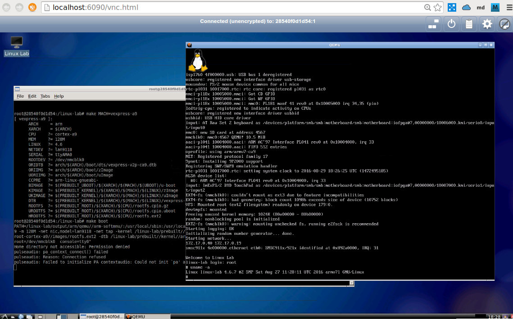

# Linux Lab

This project aims to make a Qemu-based Linux development Lab to easier the
learning and development of the [Linux Kernel](http://www.kernel.org).

For Linux 0.11, please try our [Linux 0.11 Lab](http://github.com/tinyclub/linux-0.11-lab).

## Homepage

    See: <http://tinylab.org/linux-lab/>

## Download the lab

    $ git clone https://github.com/tinyclub/linux-lab.git
    $ cd /linux-lab/

## Build the Lab

    $ sudo tools/install-docker-lab.sh
    $ tools/run-docker-lab.sh
    $ tools/open-docker-lab.sh

For Ubuntu 12.04, please install the new kernel at first, otherwise, docker will not work:

    $ sudo apt-get install linux-generic-lts-trusty

## Quickstart

Login the VNC page via `tools/open-docker-lab.sh` with 'ubuntu' password, and then open a terminal:

    $ sudo -s
    # cd /linux-lab
    # make boot

**Notes**

If don't want to input the password, after login, remove it with this command:

    # passwd -d ubuntu

If the screen size doesn't fit your display, set the scaling mode via the setting button on the top right side, or just modify the `-screen 0 1720x960x16` of `tools/supervisord.conf` to your own. the second method need to rerun `tools/install-docker-lab.sh` and `tools/run-docker-lab-daemon.h`.

## Usage

Check supported machines:

    $ make list

Check the machine specifci configuration:

    $ make list | grep Makefile
    * [machine/pc/Makefile]
    * [machine/versatilepb/Makefile]
    * [machine/g3beige/Makefile]
    * [machine/malta/Makefile]
    $ cat machine/versatilepb/Makefile
    ARCH=arm
    XARCH=$(ARCH)
    CPU=arm926t
    MEM=128M
    LINUX=2.6.35
    NETDEV=smc91c111
    SERIAL=ttyAMA0
    ROOTDEV=/dev/nfs
    ORIIMG=arch/$(ARCH)/boot/zImage
    CCPRE=arm-linux-gnueabi-
    KIMAGE=$(PREBUILT_KERNEL)/$(XARCH)/$(MACH)/$(LINUX)/zImage
    ROOTFS=$(PREBUILT_ROOTFS)/$(XARCH)/$(CPU)/rootfs.cpio.gz

Disable prebuilt kernel and rootfs via comment the `KIMAGE` and `ROOTFS`:

    $ vim machine/versatilepb/Makefile
    #KIMAGE=$(PREBUILT_KERNEL)/$(XARCH)/$(MACH)/$(LINUX)/zImage
    #ROOTFS=$(PREBUILT_ROOTFS)/$(XARCH)/$(CPU)/rootfs.cpio.gz

Download the sources:

    $ make source -j3     # All in one

    $ make kernel-source  # One by one
    $ make buildroot-source

Configure the sources:

    $ make config           # Configure all with defconfig

    $ make kernel-defconfig # Configure one by one
    $ make root-defconfig

    $ make kernel-defconfig KCO=0 # Disable checkout action

Manually configure the sources:

    $ make kernel-menuconfig
    $ make root-menuconfig

Build them:

    $ make build   # All in one

    $ make kernel  # One by one
    $ make root

    $ make kernel KP=0  # Disable kernel patch action

Boot it:

    $ make boot     # Boot with graphic

    $ make boot G=0  # Boot with serial port (no graphic), exit with 'pkill qemu'

    $ make boot PBK=0 PBD=0 PBR=0 # Disable prebuilt kernel, dtb and rootfs

    $ make boot U=1  # Boot with Uboot

Boot with different rootfs:

    $ make boot ROOTDEV=/dev/ram    # default
    $ make boot ROOTDEV=/dev/nfs
    $ make boot ROOTDEV=/dev/sda
    $ make boot ROOTDEV=/dev/mmcblk0

Debug it:

    Compile the kernel with CONFIG_DEBUG_INFO=y and boot it:

    $ make MACH=malta boot DEBUG=1

    Open a new terminal:

    $ gdb output/mipsel/linux-4.6-malta/vmlinux
    (gdb) target remote :1234
    (gdb) b kernel_entry
    (gdb) b start_kernel
    (gdb) c

Save your changes:

    $ make save         # Save all of the configs and rootfs/kernel images

    $ make kconfig-save # Save configs to machine/BOARD/, kernel config
    $ make rconfig-save # rootfs config

    $ make root-save    # Save images to prebuilt/
    $ make kernel-save

If NFS boot fails, please make sure `IP_PNP` and `ROOT_NFS` are configured in
kernel and if issue still exists, then try to fix up it:

    $ tools/restart-net-servers.sh

By default, the default machine: 'versatilepb' is used, we can configure, build
and boot for a specific machine with 'MACH', for example:

    $ make MACH=malta
    $ make root-defconfig
    $ make root
    $ make kernel-defconfig
    $ make kernel
    $ make boot

## More

Buildroot has provided many examples about buildroot and kernel configuration:

* buildroot: `configs/qemu_ARCH_BOARD_defconfig`
* kernel: `board/qemu/ARCH-BOARD/linux-VERSION.config`

To start a new ARCH, BOARD and linux VERSION test, please based on it.

Note, different qemu version uses different kernel VERSION, so, to find the
suitable kernel version, we can checkout different git tags.
